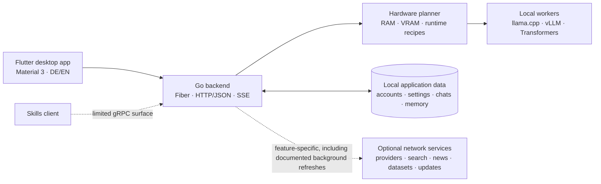

<p align="center">
  
</p>

<h1 align="center">PhiloEngine</h1>

<p align="center">
  <strong>A hardware-aware, local-first desktop studio for language models.</strong><br>
  Run models on your own machine, connect API providers when you choose, and keep one clear interface for models, agents, memory, search, and evaluation.
</p>

<p align="center">
  <a href="README.md"><strong>English</strong></a> ·
  <a href="de/README.md">Deutsch</a>
</p>

<p align="center">
  <a href="https://github.com/kuchenboss/MyPhiloEngine/releases"></a>
  
  
  <a href="https://github.com/kuchenboss/MyPhiloEngine/blob/main/LICENSE"></a>
</p>

## Contents

| Section | What you will find |
|:---|:---|
| [Download](https://github.com/kuchenboss/MyPhiloEngine/releases) | Published desktop bundles and release notes |
| [Installation](#install) | Quick install and the recommended source start |
| [Two ways to run](#one-studio-two-ways-to-run) | Local runtimes and optional API providers |
| [Highlights](#what-makes-it-different) | Engine, PhiloBots, memory, search, and marketplace |
| [Engine demo](#see-the-engine-make-a-safer-choice) | A visible hardware-aware fallback decision |
| [Features](docs/FEATURES.md) | Complete feature and maturity overview |
| [Architecture](docs/ARCHITECTURE.md) | Components, interfaces, and data flows |
| [Privacy](docs/PRIVACY.md) | Local storage and external network boundaries |
| [Transparency](docs/TRANSPARENCY.md) | Provider choices and AI-assisted development |
| [Current scope](#current-scope) | Available modules, alpha features, and phases 1–5 |
| [Documentation](#documentation) | Roadmap, troubleshooting, development, and contribution guides |

> [!IMPORTANT]
> PhiloEngine is in **Phase 1 alpha**. Chat, model management, local inference,
> API providers, memory, and the marketplace are usable today. Some surfaces
> are still evolving, and future modules remain visibly locked rather than
> pretending to be finished.

> [!NOTE]
> This documentation follows the **current development tree**, which can be
> ahead of the latest packaged release. For an installed package, its
> [release notes](https://github.com/kuchenboss/MyPhiloEngine/releases) are the
> authoritative feature list.

## One studio, two ways to run

<table>
  <tr>
    <td width="50%" valign="top">
      <h3>Run locally</h3>
      <p>PhiloEngine detects RAM, GPUs, and available VRAM before a model starts. It proposes a context size, selects a compatible runtime, and can step down to a safer configuration when the first plan does not fit.</p>
    </td>
    <td width="50%" valign="top">
      <h3>Use an API provider</h3>
      <p>Use the same marketplace and chat workflow with hosted models. Provider keys are stored in the local application data and sent only to the provider involved in that request.</p>
    </td>
  </tr>
  <tr>
    <td width="50%" valign="top"><strong>Runtimes:</strong> llama.cpp · vLLM · Transformers</td>
    <td width="50%" valign="top"><strong>Providers:</strong> OpenRouter · Featherless</td>
  </tr>
</table>

## What makes it different

<table>
  <tr>
    <td width="33%" valign="top">
      <h3>🧠 Hardware-aware engine</h3>
      <p>Model fingerprinting, memory estimates, runtime selection, context planning, GPU/CPU placement, guarded startup, and visible fallback decisions.</p>
    </td>
    <td width="33%" valign="top">
      <h3>🤖 PhiloBots with tools</h3>
      <p>Create assistants with their own prompt, style, trigger words, model binding, planning mode, project-aware file tools, permission prompts, and readable diffs.</p>
    </td>
    <td width="33%" valign="top">
      <h3>🗂️ Long-term memory</h3>
      <p>Recall across sessions with per-user and per-project storage, SQLite FTS5, vector retrieval, context budgeting, and optional embedding backends. The default is deterministic local hash embeddings; optional ONNX embeddings require a separately configured source-tree sidecar, which Quick Install does not bundle.</p>
    </td>
  </tr>
</table>

<table>
  <tr>
    <td width="50%" valign="top">
      <h3>🔎 Built-in text search</h3>
      <p>Search through DuckDuckGo, Brave, Google, Bing, or Wikipedia. Public pages can be fetched, guarded against local-network targets, and condensed to Markdown.</p>
    </td>
    <td width="50%" valign="top">
      <h3>🛍️ Unified marketplace</h3>
      <p>Browse local and hosted models together. Local candidates show formats, quantizations, estimated resource use, and a hardware-fit verdict when enough metadata is available.</p>
    </td>
  </tr>
</table>

## See the engine make a safer choice

<p align="center">
  
</p>

<p align="center"><em>A requested 64k context does not fit, so the engine retries with 32k and keeps the decision visible.</em></p>

<table>
  <tr>
    <td width="50%" valign="top">
      
      <p align="center"><strong>Model Studio</strong><br>Plan, configure, start, and observe local model instances.</p>
    </td>
    <td width="50%" valign="top">
      
      <p align="center"><strong>Marketplace</strong><br>Compare local downloads and API models in one responsive grid.</p>
    </td>
  </tr>
</table>

## How it fits together



Both application servers bind to `127.0.0.1` by default. The main desktop flow
uses HTTP/JSON and server-sent events; the current gRPC surface is limited to
Skills. See [Architecture](docs/ARCHITECTURE.md) for module and data-flow
details.

## Local-first, with explicit network boundaries

“Local-first” means that accounts, settings, chats, memory, and model files are
kept on your machine. It does **not** mean that every feature is offline:

| Action | Where data goes |
|---|---|
| Chat with a local model | Inference stays with the local backend and worker; separately configured online tools or remote embeddings can still create their own network requests |
| Chat with an API model | The selected API provider |
| Search, news, or benchmarks | The selected/public source used by that feature |
| Browse or download models | Hugging Face or the configured provider |
| Check for application updates | GitHub release infrastructure |

News, benchmark refreshes, and update checks may contact their documented
sources automatically. Read the full [privacy and network matrix](docs/PRIVACY.md)
before using PhiloEngine in a restricted environment.

> [!WARNING]
> PhiloBot adds application-level path checks and approval prompts, but command
> execution is **not an operating-system sandbox**. Bind projects carefully and
> review proposed actions and diffs.

## Install

### Quick install

Download the **Quick Install** archive for your platform from the
[releases page](https://github.com/kuchenboss/MyPhiloEngine/releases). Its
filename ends in `-<release-target>-quickinstall` followed by the archive
extension. Do not use the similarly named update archive for a first
installation. Extract the Quick Install archive once, and start
`myphiloengine` (`myphiloengine.exe` on Windows).
The launcher verifies the published archive size and SHA-256, installs updates
atomically, and can roll back a version that fails its initial health check.

| Published target | Quick Install filename ending |
|---|---|
| Linux | x64 · `-linux-x64-quickinstall.tar.gz` |
| Windows | x64 · `-windows-x64-quickinstall.zip` |
| macOS | Apple Silicon / ARM64 · `-macos-arm64-quickinstall.tar.gz` |

Quick-install users do not need Flutter or Go. See the
[installation guide](docs/INSTALLATION.md) for platform steps, update behavior,
runtime prerequisites, and troubleshooting.

### Run from source

On Linux, after completing the one-time setup described in the
[installation guide](docs/INSTALLATION.md), change to the repository directory
and start PhiloEngine with the project launcher:

```bash
cd /path/to/philoengine
./start.sh
```

`start.sh` opens the development console and manages the backend and frontend
in the intended order. On a clean `main` checkout it may apply a safe
fast-forward update first; it does not overwrite local changes.

Source development requires Go 1.25+, Flutter 3.44+ / Dart 3.12+, Python 3,
and the native toolchain required by the selected local inference runtime.

## Current scope

| Status | Modules |
|---|---|
| **Phase 1 — available** | Chat, Engine, Marketplace, authentication, user preferences, PhiloBots, memory, text search, settings, skills administration |
| **News — alpha** | AI and technology feeds with search, filters, and saved articles |
| **Benchmark — alpha** | LMArena text leaderboard with ranking, model details, and comparison views |
| **Phase 1 — active development** | Improve existing functionality, fix bugs, refine frontend design and usability, strengthen verification, and expand the documentation |
| **Phase 2 — planned** | Extend and improve current features, with usable connections to external servers |
| **Phase 3 — locked preview** | Guided full fine-tuning, fine-tuning, and quantisation workflows |
| **Phase 4 — locked preview** | Image and video generation plus a game-development workspace |
| **Phase 5 — long-term direction** | Opt-in sharing of self-hosted AI models and compute capacity, following the project's commitment to keep the PhiloEngine software free and open source |

There are no promised dates for future phases. The detailed
[roadmap](ROADMAP.md) separates working functionality from previews and planned
work. Always compare this development overview with the notes for the release
you actually install.

## Documentation

| Guide | Purpose |
|---|---|
| [Installation](docs/INSTALLATION.md) | Quick install, source setup, first run, runtimes, and updates |
| [Features](docs/FEATURES.md) | Detailed feature and maturity matrix |
| [Architecture](docs/ARCHITECTURE.md) | Components, modules, data flows, and security boundaries |
| [Privacy](docs/PRIVACY.md) | Local storage and every class of external connection |
| [Project transparency](docs/TRANSPARENCY.md) | Why these runtimes/providers exist and how AI assists development |
| [Troubleshooting](docs/TROUBLESHOOTING.md) | Startup, runtime, memory, provider, and update problems |
| [Development](docs/DEVELOPMENT.md) | Repository structure, commands, tests, and conventions |
| [Roadmap](ROADMAP.md) | Current phase, active work, and future modules |
| [Contributing](CONTRIBUTING.md) | CLA, DCO sign-off, pull requests, and verification |

## Contributing, security, and licence

Contributions are welcome, especially reproducible bug reports, fixes, hardware
compatibility feedback, tests, and documentation improvements. Start with
[CONTRIBUTING.md](CONTRIBUTING.md); contributions require acceptance of the
[CLA](https://github.com/kuchenboss/MyPhiloEngine/blob/main/CLA.md) and signed-off
commits.

Report vulnerabilities privately to `security@fillystudio.com` as described in
the [security policy](https://github.com/kuchenboss/MyPhiloEngine/blob/main/SECURITY.md).

PhiloEngine source code is licensed under the
[GNU AGPL-3.0](https://github.com/kuchenboss/MyPhiloEngine/blob/main/LICENSE).
Project names and logos are not granted by the code licence; see the
[trademark policy](https://github.com/kuchenboss/MyPhiloEngine/blob/main/TRADEMARK.md).
Models, runtimes, and bundled dependencies retain their own terms and licences.

---

<p align="center">
  <sub>Built by fillystudio · Powered by PhiloEngine</sub>
</p>
