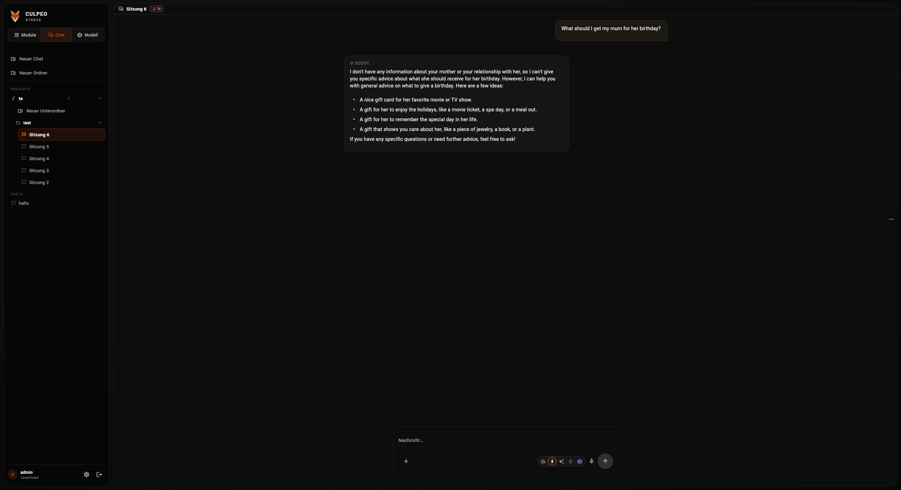
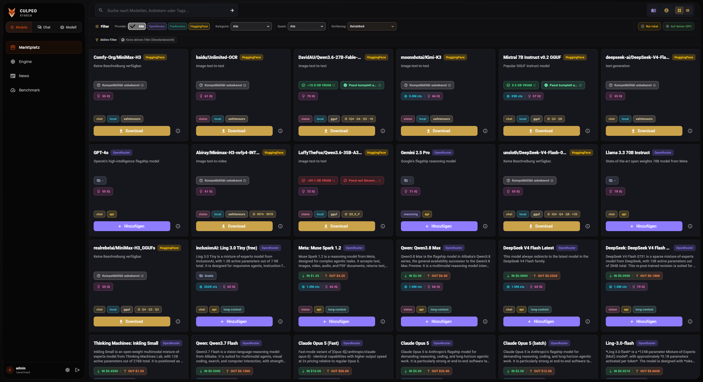
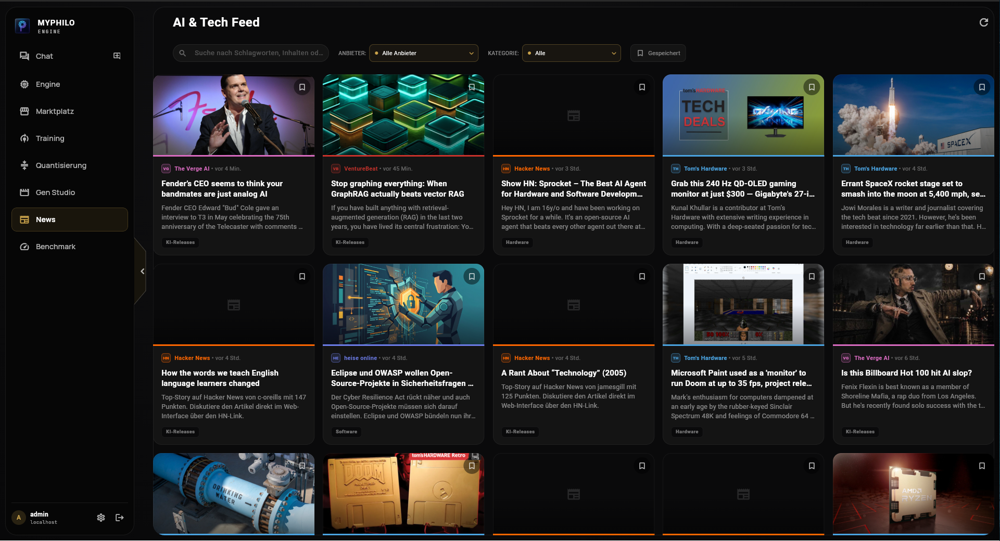
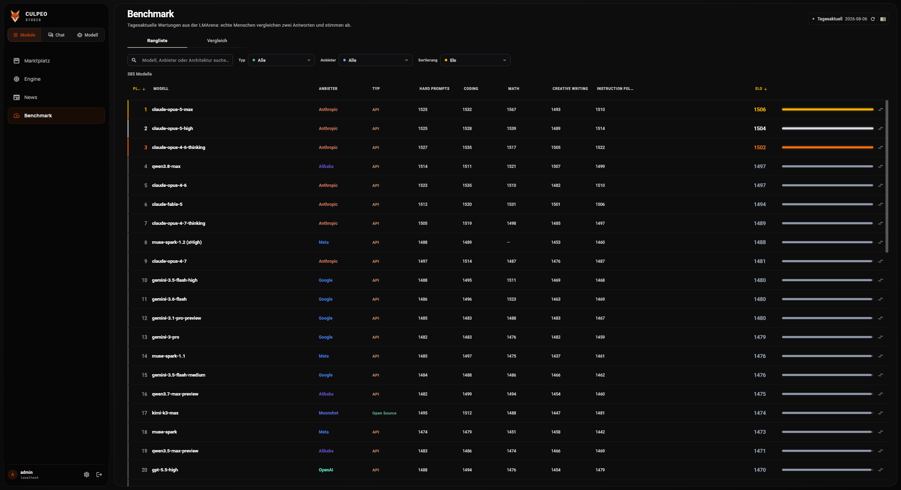

<p align="center">
  
</p>

<h1 align="center">Culpeo Studio</h1>

<p align="center">
  <strong>Hardware-Aware, Local-First Open-Source Desktop Studio for Language Models (LLMs).</strong><br>
  Run GGUF models locally with llama.cpp, connect OpenRouter & Featherless API providers, and manage Scouts agents, vector memory, web search, and benchmarks in one unified Flutter desktop workspace.
</p>

<p align="center">
  <a href="README.md"><strong>English</strong></a> ·
  <a href="de/README.md">Deutsch</a>
</p>

<p align="center">
  <a href="https://github.com/culpeostudio/Culpeostudio/releases"></a>
  
  
  <a href="https://github.com/culpeostudio/Culpeostudio/blob/main/LICENSE"></a>
</p>

## Overview

**Culpeo Studio** is a desktop app for working with language models. You can download and run GGUF models on your own machine, connect an API provider when a hosted model makes more sense, and keep chats, settings, and memory local by default.

The app is still in Phase 1 Beta. The main workflows are usable, while some modules — especially News and Benchmark — are still being refined.

| Key Feature | Implementation & Technology |
|:---|:---|
| **Local LLM Engine** | `llama.cpp` (`llama-server`) with CUDA, Vulkan, SYCL, Metal, and CPU acceleration |
| **Control Plane** | Go 1.25+ gRPC micro-services (`culpeostudio.*.v1`) on loopback port 50051 |
| **Frontend UI** | Flutter 3.44+ / Dart 3.12+ Material 3 client using adaptive CulpeoGrid System |
| **AI Assistants** | Scouts agent runner with tool execution, planning mode, permission prompts, and diffs |
| **Long-Term Memory** | Hybrid SQLite FTS5 lexical search + vector retrieval (local 128-d hash default or ONNX) |
| **Web Search** | CulpeoSearch metasearch (DuckDuckGo, Brave, Google, Bing, Wikipedia) with Markdown extraction |
| **Supported Formats** | GGUF quantized models from Hugging Face alongside OpenRouter and Featherless APIs |

---

## Contents

| Section | Description |
|:---|:---|
| [Download](https://github.com/culpeostudio/Culpeostudio/releases) | Published desktop bundles and release notes |
| [Installation](#install) | Quick install and source build instructions |
| [Two Ways to Run](#one-studio-two-ways-to-run) | Local runtimes vs hosted API providers |
| [Highlights](#what-makes-it-different) | Hardware engine, Scouts, memory, search, marketplace |
| [Engine Demo](#see-the-engine-make-a-safer-choice) | Automated VRAM fallback demonstration |
| [Features](docs/FEATURES.md) | Complete feature maturity matrix |
| [Architecture](docs/ARCHITECTURE.md) | Component map and gRPC service overview |
| [Privacy](docs/PRIVACY.md) | Network boundaries and security guarantees |
| [Transparency](docs/TRANSPARENCY.md) | Open-source licensing and technology stack |
| [Current Scope](#current-scope) | Available modules and development roadmap |

> [!IMPORTANT]
> Culpeo Studio is in **Phase 1 Beta**. Chat, model management, local inference,
> API providers, memory, and the marketplace are fully usable today.

---

## One studio, two ways to run

<table>
  <tr>
    <td width="50%" valign="top">
      <h3>Run locally</h3>
      <p>Before a local model starts, Culpeo Studio checks the available RAM, GPU, and VRAM. If the requested setup does not fit, it retries with a smaller context or a CPU configuration.</p>
    </td>
    <td width="50%" valign="top">
      <h3>Use an API provider</h3>
      <p>Hosted models use the same marketplace and chat flow. Your provider key stays in the local application data and is used only for requests to the provider you selected.</p>
    </td>
  </tr>
  <tr>
    <td width="50%" valign="top"><strong>Engine:</strong> llama.cpp (CUDA · Vulkan · SYCL · Metal · CPU)</td>
    <td width="50%" valign="top"><strong>Providers:</strong> OpenRouter · Featherless</td>
  </tr>
</table>

---

## What you can do with it

<table>
  <tr>
    <td width="33%" valign="top">
      <h3>Hardware-aware engine</h3>
      <p>Pick a model, see whether it fits your hardware, and let the engine choose a workable context and GPU offload.</p>
    </td>
    <td width="33%" valign="top">
      <h3>Scouts with tools</h3>
      <p>Create focused assistants, bind them to a model and project, and review proposed file changes before applying them.</p>
    </td>
    <td width="33%" valign="top">
      <h3>Long-term vector memory</h3>
      <p>Keep useful context between sessions with local SQLite storage, text search, vector retrieval, and a configurable context budget.</p>
    </td>
  </tr>
</table>

<table>
  <tr>
    <td width="50%" valign="top">
      <h3>Built-in text search</h3>
      <p>Search public sources from the app and turn fetched pages into readable Markdown for a Scout or a chat.</p>
    </td>
    <td width="50%" valign="top">
      <h3>Unified marketplace</h3>
      <p>Compare local GGUF downloads and hosted models in one place, including quantization, price, context, and hardware-fit details.</p>
    </td>
  </tr>
</table>

---

## A quick look at the app

<table>
  <tr>
    <td width="50%" valign="top">
      
      <p align="center"><strong>Chat</strong><br>Keep projects and sessions together while you work.</p>
    </td>
    <td width="50%" valign="top">
      
      <p align="center"><strong>Marketplace</strong><br>Filter local downloads and API models by provider and fit.</p>
    </td>
  </tr>
  <tr>
    <td width="50%" valign="top">
      
      <p align="center"><strong>News</strong><br>Browse, filter, and save AI and technology articles.</p>
    </td>
    <td width="50%" valign="top">
      
      <p align="center"><strong>Benchmark</strong><br>Compare models by category and overall ranking.</p>
    </td>
  </tr>
</table>

---

## Local-first, with explicit network boundaries

“Local-first” means accounts, settings, chats, memory, and GGUF model files remain strictly on your machine:

| Action | Where data goes |
|---|---|
| Chat with a local model | Local backend and llama.cpp worker (`127.0.0.1`); no external network requests |
| Chat with an API model | The selected API provider (OpenRouter / Featherless) |
| Web Search, News, or Benchmarks | Public endpoints used by CulpeoSearch, News feeds, and LMArena leaderboard |
| Download local models | Hugging Face repositories |
| Application update checks | GitHub release infrastructure |

> [!WARNING]
> Scout tool execution includes project path validation and explicit permission prompts, but command execution is **not an operating-system sandbox**. Bind projects carefully and review proposed actions.

---

## Install

### Quick install

Download the precompiled **Quick Install** package from the [releases page](https://github.com/culpeostudio/Culpeostudio/releases). Extract the archive and launch `culpeostudio` (`culpeostudio.exe` on Windows). The launcher verifies SHA-256 integrity, manages atomic updates, and supports rollback.

| Target Platform | Quick Install Filename Ending |
|---|---|
| **Linux x64** | `-linux-x64-quickinstall.tar.gz` |
| **Windows x64** | `-windows-x64-quickinstall.zip` |
| **macOS ARM64** | `-macos-arm64-quickinstall.tar.gz` |

Quick-install users do not need Flutter or Go pre-installed. See the [installation guide](docs/INSTALLATION.md) for platform steps.

### Run from source

On Linux systems, clone the repository and start Culpeo Studio with the development script:

```bash
git clone https://github.com/culpeostudio/Culpeostudio.git
cd Culpeostudio
./start.sh
```

Source builds require Go 1.25+, Flutter 3.44+ / Dart 3.12+, Python 3, and a C/C++ toolchain.

---

## Current scope

| Status | Modules |
|---|---|
| **Phase 1 — available** | Chat, Engine, Marketplace, authentication, user preferences, Scouts, memory, text search, settings, skills administration |
| **News — Beta** | AI and technology feeds with search, filters, and saved articles |
| **Benchmark — Beta** | LMArena text leaderboard with ranking, model details, and comparison views |
| **Phase 1 — active development** | Improve existing functionality, fix bugs, refine frontend design and usability, strengthen verification, and expand documentation |
| **Phase 2 — planned** | Extend current features with remote gRPC server connections |
| **Phase 3 — planned** | Guided LoRA/QLoRA fine-tuning and GGUF/EXL2 quantization workflows |
| **Phase 4 — planned** | Local image and video generation plus game-development workspace |
| **Phase 5 — long-term direction** | Opt-in sharing of self-hosted AI models and compute capacity |

---

## Contributing, security, and licence

Contributions are welcome! Read [CONTRIBUTING.md](CONTRIBUTING.md) to get started. Pull requests require acceptance of the [CLA](https://github.com/culpeostudio/Culpeostudio/blob/main/CLA.md) and signed-off commits (`git commit -s`).

Report security vulnerabilities privately to `security@culpeohq.com` as outlined in [SECURITY.md](https://github.com/culpeostudio/Culpeostudio/blob/main/SECURITY.md).

Culpeo Studio source code is licensed under the [GNU AGPL-3.0](https://github.com/culpeostudio/Culpeostudio/blob/main/LICENSE). See the [trademark policy](https://github.com/culpeostudio/Culpeostudio/blob/main/TRADEMARK.md) for name and logo usage guidelines.

---

<p align="center">
  <sub>Built by culpeohq · Powered by Culpeo Studio</sub>
</p>
