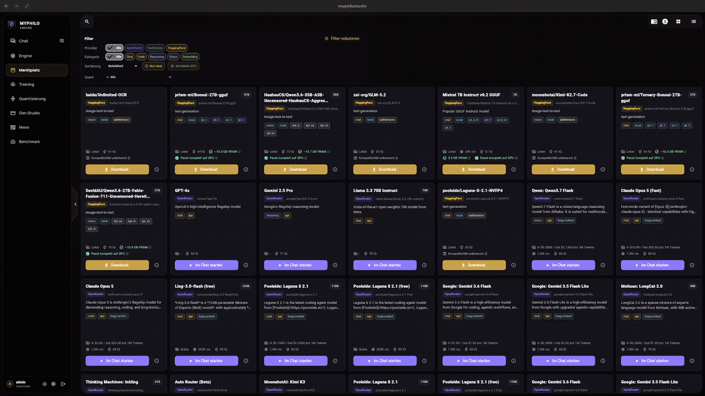
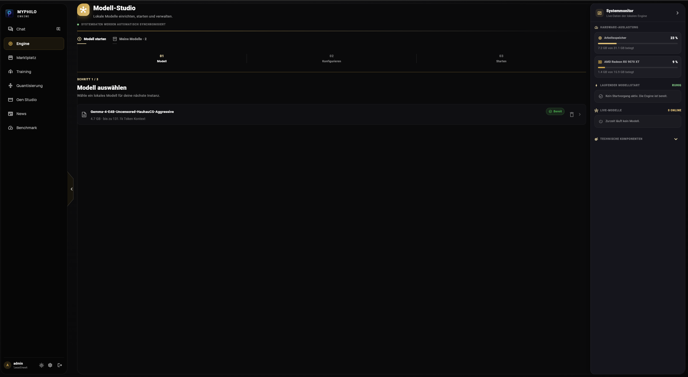
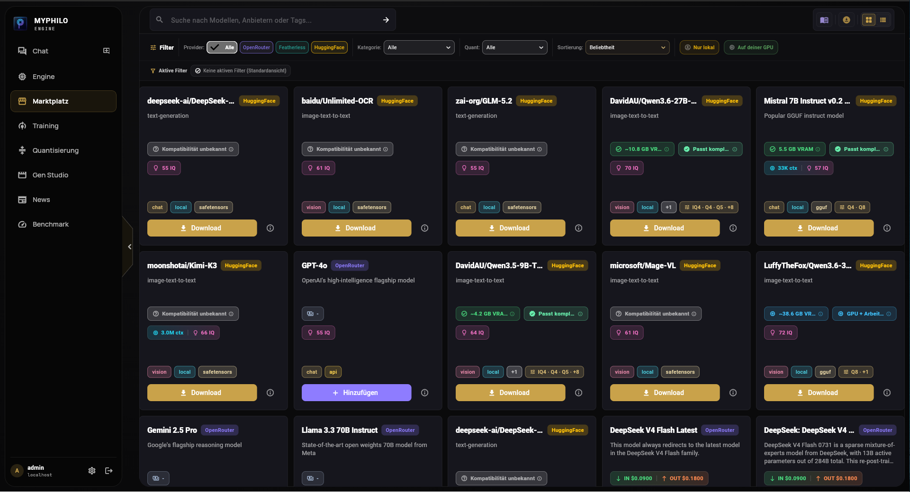
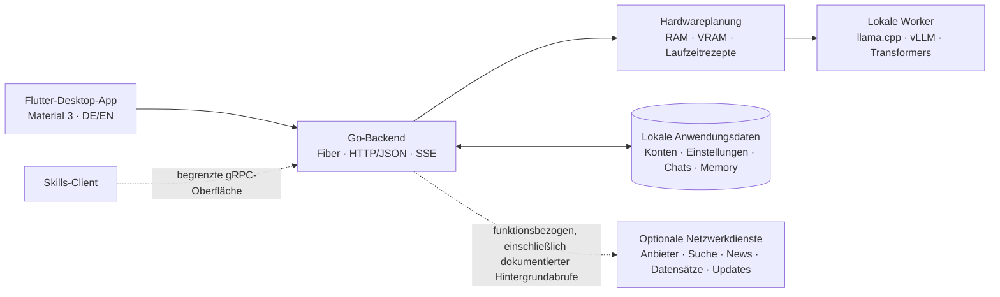

<p align="center">
  
</p>

<h1 align="center">PhiloEngine</h1>

<p align="center">
  <strong>Ein hardwarebewusstes Local-first-Desktop-Studio für Sprachmodelle.</strong><br>
  Führe Modelle auf deinem eigenen Rechner aus, verbinde bei Bedarf API-Anbieter und nutze eine übersichtliche Oberfläche für Modelle, Agenten, Memory, Suche und Evaluation.
</p>

<p align="center">
  <a href="README.md"><strong>Deutsch</strong></a> ·
  <a href="../README.md">English</a>
</p>

<p align="center">
  <a href="https://github.com/kuchenboss/MyPhiloEngine/releases"></a>
  
  
  <a href="https://github.com/kuchenboss/MyPhiloEngine/blob/main/LICENSE"></a>
</p>

## Inhaltsverzeichnis

| Bereich | Inhalt |
|:---|:---|
| [Download](https://github.com/kuchenboss/MyPhiloEngine/releases) | Veröffentlichte Desktop-Pakete und Release-Hinweise |
| [Installation](#installation) | Schnellinstallation und empfohlener Start aus dem Quellcode |
| [Zwei Betriebsarten](#ein-studio-zwei-betriebsarten) | Lokale Laufzeiten und optionale API-Anbieter |
| [Besonderheiten](#das-macht-philoengine-besonders) | Engine, PhiloBots, Memory, Suche und Marketplace |
| [Engine-Demo](#so-trifft-die-engine-eine-sicherere-entscheidung) | Eine sichtbare, hardwarebewusste Fallback-Entscheidung |
| [Funktionen](docs/FEATURES.md) | Vollständige Funktions- und Reifegradübersicht |
| [Architektur](docs/ARCHITECTURE.md) | Komponenten, Schnittstellen und Datenflüsse |
| [Datenschutz](docs/PRIVACY.md) | Lokale Speicherung und externe Netzwerkgrenzen |
| [Transparenz](docs/TRANSPARENCY.md) | Anbieterentscheidungen und KI-Unterstützung bei der Entwicklung |
| [Aktueller Umfang](#aktueller-umfang) | Verfügbare Module, Alpha-Funktionen und die Phasen 1–5 |
| [Dokumentation](#dokumentation) | Roadmap, Fehlerbehebung, Entwicklung und Mitwirkung |

> [!IMPORTANT]
> PhiloEngine befindet sich in der **Alpha-Phase 1**. Chat, Modellverwaltung,
> lokale Inferenz, API-Anbieter, Memory und Marketplace sind bereits nutzbar.
> Einige Bereiche werden noch weiterentwickelt; zukünftige Module bleiben
> sichtbar gesperrt, statt den Eindruck zu erwecken, sie seien bereits fertig.

> [!NOTE]
> Diese Dokumentation folgt dem **aktuellen Entwicklungsstand**, der dem
> neuesten veröffentlichten Paket voraus sein kann. Für ein installiertes Paket
> sind die zugehörigen [Release-Hinweise](https://github.com/kuchenboss/MyPhiloEngine/releases)
> die maßgebliche Funktionsliste.

## Ein Studio, zwei Betriebsarten

<table>
  <tr>
    <td width="50%" valign="top">
      <h3>Lokal ausführen</h3>
      <p>Bevor ein Modell startet, erkennt PhiloEngine RAM, GPUs und verfügbaren VRAM. Es schlägt eine Kontextgröße vor, wählt eine kompatible Laufzeit und kann auf eine sicherere Konfiguration zurückfallen, wenn der erste Plan nicht in den verfügbaren Speicher passt.</p>
    </td>
    <td width="50%" valign="top">
      <h3>Einen API-Anbieter nutzen</h3>
      <p>Nutze denselben Marketplace und Chatablauf für gehostete Modelle. Anbieterschlüssel werden in den lokalen Anwendungsdaten gespeichert und nur an den Anbieter gesendet, der die jeweilige Anfrage verarbeitet.</p>
    </td>
  </tr>
  <tr>
    <td width="50%" valign="top"><strong>Laufzeiten:</strong> llama.cpp · vLLM · Transformers</td>
    <td width="50%" valign="top"><strong>Anbieter:</strong> OpenRouter · Featherless</td>
  </tr>
</table>

## Das macht PhiloEngine besonders

<table>
  <tr>
    <td width="33%" valign="top">
      <h3>🧠 Hardwarebewusste Engine</h3>
      <p>Modell-Fingerprinting, Speicherabschätzung, Laufzeitauswahl, Kontextplanung, GPU-/CPU-Platzierung, abgesicherter Start und nachvollziehbare Fallback-Entscheidungen.</p>
    </td>
    <td width="33%" valign="top">
      <h3>🤖 PhiloBots mit Werkzeugen</h3>
      <p>Erstelle Assistenten mit eigenem Prompt, Antwortstil, Auslösewörtern, Modellbindung, Planungsmodus, projektbezogenen Dateiwerkzeugen, Berechtigungsabfragen und lesbaren Diffs.</p>
    </td>
    <td width="33%" valign="top">
      <h3>🗂️ Langzeit-Memory</h3>
      <p>Erinnerungen über Sitzungen hinweg – mit nutzer- und projektbezogener Speicherung, SQLite FTS5, Vektorsuche, Kontextbudgetierung und optionalen Embedding-Backends. Standardmäßig werden deterministische lokale Hash-Embeddings verwendet; optionale ONNX-Embeddings benötigen einen separat konfigurierten Sidecar aus dem Quellcode, den die Schnellinstallation nicht mitliefert.</p>
    </td>
  </tr>
</table>

<table>
  <tr>
    <td width="50%" valign="top">
      <h3>🔎 Integrierte Textsuche</h3>
      <p>Suche über DuckDuckGo, Brave, Google, Bing oder Wikipedia. Öffentliche Seiten können abgerufen, gegen Zugriffe auf Ziele im lokalen Netzwerk abgesichert und zu Markdown verdichtet werden.</p>
    </td>
    <td width="50%" valign="top">
      <h3>🛍️ Einheitlicher Marketplace</h3>
      <p>Durchsuche lokale und gehostete Modelle gemeinsam. Für lokale Kandidaten werden Format, Quantisierung, geschätzter Ressourcenbedarf und – bei ausreichenden Metadaten – eine Bewertung der Hardware-Eignung angezeigt.</p>
    </td>
  </tr>
</table>

## So trifft die Engine eine sicherere Entscheidung

<p align="center">
  
</p>

<p align="center"><em>Der angeforderte 64k-Kontext passt nicht in den Speicher. Daher versucht es die Engine erneut mit 32k und macht diese Entscheidung weiterhin sichtbar.</em></p>

<table>
  <tr>
    <td width="50%" valign="top">
      
      <p align="center"><strong>Model Studio</strong><br>Lokale Modellinstanzen planen, konfigurieren, starten und beobachten.</p>
    </td>
    <td width="50%" valign="top">
      
      <p align="center"><strong>Marketplace</strong><br>Lokale Downloads und API-Modelle in einem responsiven Raster vergleichen.</p>
    </td>
  </tr>
</table>

## So greifen die Komponenten ineinander



Beide Anwendungsserver binden standardmäßig an `127.0.0.1`. Der zentrale
Desktopablauf verwendet HTTP/JSON und Server-Sent Events; die aktuelle
gRPC-Oberfläche ist auf Skills beschränkt. Die [Architekturübersicht](docs/ARCHITECTURE.md)
beschreibt Module und Datenflüsse ausführlicher.

## Local-first mit klaren Netzwerkgrenzen

„Local-first“ bedeutet, dass Konten, Einstellungen, Chats, Memory und
Modelldateien auf deinem Rechner gespeichert werden. Es bedeutet **nicht**,
dass jede Funktion offline arbeitet:

| Aktion | Wohin die Daten gehen |
|---|---|
| Chat mit einem lokalen Modell | Die Inferenz bleibt beim lokalen Backend und Worker; separat eingerichtete Onlinewerkzeuge oder entfernte Embedding-Dienste können weiterhin eigene Netzwerkanfragen auslösen |
| Chat mit einem API-Modell | An den ausgewählten API-Anbieter |
| Suche, News oder Benchmarks | An die jeweils ausgewählte oder von der Funktion genutzte öffentliche Quelle |
| Modelle entdecken oder herunterladen | An Hugging Face oder den eingerichteten Anbieter |
| Nach Anwendungsupdates suchen | An die GitHub-Release-Infrastruktur |

News, Benchmark-Aktualisierungen und Updateprüfungen können ihre dokumentierten
Quellen automatisch kontaktieren. Lies vor dem Einsatz von PhiloEngine in einer
eingeschränkten Umgebung die vollständige [Datenschutz- und Netzwerkmatrix](docs/PRIVACY.md).

> [!WARNING]
> PhiloBot ergänzt Pfadprüfungen und Freigabeabfragen auf Anwendungsebene, doch
> die Befehlsausführung ist **keine Sandbox des Betriebssystems**. Binde Projekte
> mit Bedacht ein und prüfe vorgeschlagene Aktionen und Diffs.

## Installation

### Schnellinstallation

Lade das **Schnellinstallationsarchiv** für deine Plattform von der
[Release-Seite](https://github.com/kuchenboss/MyPhiloEngine/releases) herunter.
Sein Dateiname endet auf `-<release-target>-quickinstall`, gefolgt von der
Archivendung. Verwende für die Erstinstallation nicht das ähnlich benannte
Updatearchiv. Entpacke das Schnellinstallationsarchiv einmal und starte
`myphiloengine` (unter Windows `myphiloengine.exe`). Der Launcher prüft die
veröffentlichte Archivgröße und
SHA-256-Prüfsumme, installiert Updates atomar und kann eine Version
zurückrollen, wenn deren erste Zustandsprüfung fehlschlägt.

| Veröffentlichtes Zielsystem | Dateiendung der Schnellinstallation |
|---|---|
| Linux | x64 · `-linux-x64-quickinstall.tar.gz` |
| Windows | x64 · `-windows-x64-quickinstall.zip` |
| macOS | Apple Silicon / ARM64 · `-macos-arm64-quickinstall.tar.gz` |

Für die Schnellinstallation werden weder Flutter noch Go benötigt. Der
[Installationsleitfaden](docs/INSTALLATION.md) erklärt die plattformspezifischen
Schritte, das Updateverhalten, Laufzeitvoraussetzungen und die Fehlerbehebung.

### Aus dem Quellcode starten

Wechsle unter Linux nach der einmaligen Einrichtung aus dem
[Installationsleitfaden](docs/INSTALLATION.md) in den Projektordner und starte
PhiloEngine über das Projektskript:

```bash
cd /pfad/zu/philoengine
./start.sh
```

`start.sh` öffnet die Entwicklungskonsole und verwaltet Backend und Frontend in
der vorgesehenen Reihenfolge. Bei einem unveränderten `main`-Checkout kann das
Skript zuvor ein sicheres Fast-Forward-Update anwenden; lokale Änderungen
werden nicht überschrieben.

Für die Entwicklung aus dem Quellcode werden Go 1.25+, Flutter 3.44+ /
Dart 3.12+, Python 3 sowie die nativen Toolchains der ausgewählten lokalen
Inferenzlaufzeit benötigt.

## Aktueller Umfang

| Status | Module |
|---|---|
| **Phase 1 — verfügbar** | Chat, Engine, Marketplace, Authentifizierung, Nutzereinstellungen, PhiloBots, Memory, Textsuche, Einstellungen und Skills-Verwaltung |
| **News — Alpha** | KI- und Technologie-Feeds mit Suche, Filtern und gespeicherten Artikeln |
| **Benchmark — Alpha** | LMArena-Text-Leaderboard mit Ranking, Modelldetails und Vergleichsansichten |
| **Phase 1 — aktive Entwicklung** | Bestehende Funktionen verbessern, Fehler beheben, Frontend-Design und Bedienbarkeit verfeinern, Prüfungen stärken und die Dokumentation ausbauen |
| **Phase 2 — geplant** | Vorhandene Funktionen erweitern und verbessern sowie externe Server nutzbar anbinden |
| **Phase 3 — gesperrte Vorschau** | Geführte Abläufe für Full-Finetuning, Finetuning und Quantisierung |
| **Phase 4 — gesperrte Vorschau** | Bild- und Videogenerierung sowie ein Arbeitsbereich für Spieleentwicklung |
| **Phase 5 — langfristige Richtung** | Selbst gehostete KI-Modelle und Rechenleistung freiwillig bereitstellen, verbunden mit dem Projektversprechen, die PhiloEngine-Software kostenlos und Open Source zu halten |

Für zukünftige Phasen werden keine Termine zugesagt. Die ausführliche
[Roadmap](ROADMAP.md) trennt nutzbare Funktionen von Vorschauen und geplanter
Arbeit. Vergleiche diese Entwicklungsübersicht immer mit den Hinweisen des
tatsächlich installierten Releases.

## Dokumentation

| Leitfaden | Zweck |
|---|---|
| [Installation](docs/INSTALLATION.md) | Schnellinstallation, Quellcode-Setup, erster Start, Laufzeiten und Updates |
| [Funktionen](docs/FEATURES.md) | Ausführliche Funktions- und Reifegradmatrix |
| [Architektur](docs/ARCHITECTURE.md) | Komponenten, Module, Datenflüsse und Sicherheitsgrenzen |
| [Datenschutz](docs/PRIVACY.md) | Lokale Speicherung und alle Arten externer Verbindungen |
| [Projekttransparenz](docs/TRANSPARENCY.md) | Warum diese Laufzeiten und Anbieter enthalten sind und wie KI die Entwicklung unterstützt |
| [Fehlerbehebung](docs/TROUBLESHOOTING.md) | Probleme bei Start, Laufzeit, Speicher, Anbietern und Updates |
| [Entwicklung](docs/DEVELOPMENT.md) | Repository-Struktur, Befehle, Tests und Konventionen |
| [Roadmap](ROADMAP.md) | Aktuelle Phase, aktive Arbeiten und zukünftige Module |
| [Mitwirken](CONTRIBUTING.md) | CLA, DCO-Sign-off, Pull Requests und Verifikation |

## Mitwirken, Sicherheit und Lizenz

Beiträge sind willkommen – besonders reproduzierbare Fehlerberichte,
Korrekturen, Rückmeldungen zur Hardwarekompatibilität, Tests und Verbesserungen
der Dokumentation. Beginne mit [CONTRIBUTING.md](CONTRIBUTING.md); für Beiträge
sind die Annahme des
[CLA](https://github.com/kuchenboss/MyPhiloEngine/blob/main/CLA.md) sowie ein
DCO-Sign-off für jeden Commit erforderlich.

Melde Sicherheitslücken vertraulich an `security@fillystudio.com`, wie in
der [Sicherheitsrichtlinie](https://github.com/kuchenboss/MyPhiloEngine/blob/main/SECURITY.md)
beschrieben.

Der Quellcode von PhiloEngine steht unter der
[GNU AGPL-3.0](https://github.com/kuchenboss/MyPhiloEngine/blob/main/LICENSE).
Die Softwarelizenz gewährt keine Rechte an Projektnamen und Logos; siehe
[Markenrichtlinie](https://github.com/kuchenboss/MyPhiloEngine/blob/main/TRADEMARK.md).
Für Modelle, Laufzeiten und mitgelieferte Abhängigkeiten gelten weiterhin deren
jeweilige Bedingungen und Lizenzen.

---

<p align="center">
  <sub>Entwickelt von fillystudio · Angetrieben von PhiloEngine</sub>
</p>
