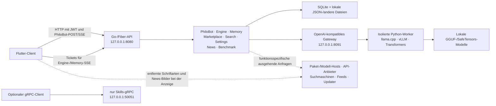

# Architektur von PhiloEngine

**Deutsch** · [English](../../docs/ARCHITECTURE.md)

> [!IMPORTANT]
> **Architekturreferenz für die Alpha-Version.** Dieses Dokument beschreibt den
> aktuellen lokalen Arbeitsstand und ist kein Versprechen, dass jede Oberfläche
> produktionsreif ist. HTTP/SSE ist primär: Engine- und Memory-Ereignisfeeds
> verwenden Tickets, PhiloBot streamt dagegen über einen authentifizierten
> POST. Der einzige derzeit im Server eingebundene gRPC-Dienst ist **Skills**.

> [!WARNING]
> **Grenze der veröffentlichten Version.** Ein Entwicklungsstand kann Module und
> Routen enthalten, die dem installierten Paket fehlen. Prüfe die
> Release-Hinweise dieses Builds, bevor du dich auf etwas hier Beschriebenes
> verlässt.

[← README](../README.md) · [Datenschutz](PRIVACY.md) · [Fehlerbehebung](TROUBLESHOOTING.md)

## Überblick

PhiloEngine ist eine Local-First-KI-Arbeitsumgebung mit einem Flutter-Client, einer Go-Steuerungsebene, isolierten Python-Modell-Workern und lokaler Datenhaltung. Cloud-Anbieter und öffentliche Webquellen sind optional oder funktionsspezifisch; das System ist standardmäßig nicht vom Netzwerk isoliert.

Die drei dargestellten festen Anwendungs-Listener sind standardmäßig an die
Loopback-Schnittstelle gebunden. Modell-Worker verwenden dynamisch ausgewählte
Loopback-Ports. `HTTP_HOST` ändert den Bind-Host von HTTP und gRPC, während das
Modell-Gateway Bindungen außerhalb von Loopback ablehnt. Wird einer der beiden
Hauptdienste über den Rechner hinaus freigegeben, ändern sich die unter
[Datenschutz](PRIVACY.md) beschriebenen Sicherheitsannahmen.

## Komponentenübersicht

| Ebene | Derzeitige Aufgabe | Grenze der Alpha-Version |
|---|---|---|
| Flutter-Client | Flutter-Quellcode für Desktop-/Web-Ziele; öffentliche kompilierte Artefakte gibt es derzeit für Linux x64, Windows x64 und macOS ARM64 | Ein sichtbarer Eintrag bedeutet keinen lokalen Backend-Ablauf |
| Go-HTTP-API | Primäre Steuerungsebene für Konten, PhiloBot, Modelle, Memory, Suche, Einstellungen und Inhaltsmodule | API-Strukturen können sich während der Alpha-Phase noch ändern |
| SSE | PhiloBot-Chat streamt über einen authentifizierten POST; Engine- und Memory-Ereignisfeeds verwenden kurzlebige Tickets | Tickets der Ereignisfeeds sind absichtlich nur einmal verwendbar und laufen schnell ab |
| gRPC | Skills-Dienst mit aktivierter Reflection | Andere Proto-Definitionen sind noch keine registrierten Dienste |
| Engine | Erkennt Modelle, plant Ressourcen, installiert Laufzeitumgebungen, startet Worker und behandelt Fallback/Rollback | Hardware- und Paketkompatibilität wird zur Laufzeit geprüft; kein Backend funktioniert auf jedem Rechner |
| Memory | Benutzerspezifischer SQLite-Verlauf, FTS5-Suche, Vektorindex, Zusammenfassungen und Abruf | Die Standard-Embeddings sind deterministische Hash-Vektoren und kein neuronales Embedding-Modell |
| PhiloSearch | Parallele Metasuche im öffentlichen Web und Seitenextraktion | Derzeit sind Engines nur für die Kategorie **Text** registriert |
| News | Feed-Aggregation, Kategorisierung, Cache und benutzerspezifisch gespeicherte Artikel | Experimentelle Arbeit der Phase 1; einige Quellen sind Best-Effort-Scraper |
| Benchmark | LMArena-Text-Snapshot, Filterung, Vergleich und optionale Modellmetadaten | Es ist nur `arena_text` registriert |

## HTTP-Steuerungsebene

Das Backend gruppiert die meisten Anwendungsrouten unter `/api` und schützt sie
durch JWT-Authentifizierung. Memory-Routen können stattdessen ihr separates
Memory-Bearer-Token verwenden. Routen für die Ersteinrichtung und Anmeldung
sind Ausnahmen. Healthchecks sowie ausgewählte Viewer-/Ereignispfade liegen
außerhalb dieser Gruppe; Engine- und Memory-Ereignisfeeds benötigen dennoch
eigens dafür vorgesehene Tickets.

| Routenfamilie | Zuständigkeit |
|---|---|
| `/api/login`, `/api/auth`, `/api/accounts` | Einrichtung, Anmeldung, Kontoverwaltung, Sitzungseinstellungen |
| `/api/philobot` | Sitzungen, Nachrichten, POST-/SSE-Streaming mit JWT-Authentifizierung, Bots, Projekte, Modellbindung, Berechtigungsantworten |
| `/api/engine` | Katalog, Fähigkeiten, Installation von Laufzeitumgebungen, Instanzen, Vorgänge, Metriken, Gateway-Schlüssel, SSE-Tickets |
| `/api/memory` | Zustand, Beobachtungen, Prompts, Suche, Zeitleiste, Kontext, Wartungsereignisse |
| `/api/skills` | Erkennung, Import, erneutes Einlesen, Aktualisierung und Löschung von Skills |
| `/api/marktplatz` | Modellsuche, Downloads, Hardwareprofil, Konfiguration entfernter API-Modelle |
| `/api/search` | Textsuche, Extraktion und Engine-Erkennung; Routen anderer Kategorien sind derzeit Platzhalter |
| `/api/news` | Live-/Cache-Artikellisten und benutzerspezifisch gespeicherte Artikel |
| `/api/benchmark` | Board-Status, Übersicht, Rangliste, Details, Vergleich und Aktualisierung |
| `/api/settings` | Lokale Einstellungen, Systemdaten, Verbindungstests für Anbieter |

Die HTTP-API ist die unterstützte Integrationsschnittstelle für aktuelle Clients. Aus der bloßen Existenz einer Proto-Datei darf nicht auf eine funktionierende gRPC-Methode geschlossen werden.

## Modellausführung

1. Der Katalog durchsucht das konfigurierte Modellverzeichnis nach GGUF- und SafeTensors-Artefakten.
2. Die Hardwareprüfung erfasst aktuelle Informationen zu CPU, RAM, Datenträgern und verfügbaren Beschleunigern.
3. Der Planer reserviert Spielraum auf Host/GPU und schlägt einen Kontext- und Platzierungsplan vor.
4. Eine inhaltsadressierte Python-Umgebung wird ausgewählt oder installiert und per Smoke-Test geprüft.
5. Ein ausschließlich an Loopback gebundener Worker startet mit einem prozessspezifischen Bearer-Secret.
6. Das lokale Gateway leitet kompatible Generierungsanfragen an den aktiven Worker weiter.
7. Fallbacks für Laufzeitumgebung, Gerät, KV-Cache und reduzierten Kontext können versucht werden; nach einer fehlgeschlagenen Änderung lässt sich der letzte bekannte funktionsfähige Zustand wiederherstellen.

| Modell / Host | Bevorzugte Laufzeitumgebung | Hinweise |
|---|---|---|
| GGUF | llama.cpp | CPU- und unterstützte Beschleuniger-Builds; die Paketinstallation kann nativen Code kompilieren |
| SafeTensors unter Linux mit geeignetem CUDA oder ROCm | vLLM | Kann auf Transformers zurückfallen, wenn Start- oder Kompatibilitätsprüfungen fehlschlagen |
| Andere unterstützte SafeTensors-Hosts | Transformers | Wird für CPU- und unterstützte Beschleuniger-Fallbacks verwendet |

Laufzeitumgebungen werden bei Bedarf heruntergeladen und setzen eine Python-3-Installation auf dem Host voraus. llama.cpp-Builds benötigen außerdem CMake sowie C/C++-Buildwerkzeuge; Beschleuniger-Builds können das passende SDK und entsprechende Treiber erfordern. Nach der Installation fordern Worker nur lokale Modelldateien an und setzen gängige Offline-Flags von Hugging Face/Transformers. Die erstmalige Installation einer Laufzeitumgebung unterscheidet sich daher von der Offline-Inferenz.

`trust_remote_code` ist standardmäßig deaktiviert und kann für jedes Modell ausdrücklich aktiviert werden. PhiloEngine ändert derzeit KV-Cache-Modi; es wird **nicht** behauptet, dass Modellgewichte automatisch quantisiert werden.

## Memory und Abruf

Memory verwendet eine SQLite-Datenbank mit strukturierten Sitzungen, Prompts, Beobachtungen, Zusammenfassungen, FTS5-Dokumenten und sqlite-vec-Indizes. Der Abruf ist nach Benutzer getrennt und kann nach Projekt, Quelle, Ebene und Kategorie gefiltert werden.

- Das standardmäßige Embedding-Backend ist eine deterministische, 128-dimensionale Hash-Implementierung.
- Optionale lokale ONNX-, Ollama- und entfernte API-Embedding-Backends können konfiguriert werden.
- Ist ein optionales Backend nicht verfügbar, wird auf die Hash-Implementierung zurückgefallen.
- Die Suche kombiniert lexikalische, vektorbasierte, zeitliche, typ- und quellenspezifische Signale.
- Die Komprimierung hält aktuelle Beobachtungen aktiv und erzeugt standardmäßig deterministische, regelbasierte Zusammenfassungen.

Dies ist eine nützliche hybride Informationsgewinnung, sollte aber nicht als neuronales semantisches Gedächtnis bezeichnet werden, solange nicht tatsächlich ein neuronales Embedding-Backend konfiguriert ist.

Das Repository enthält unter `backend/sidecar/` einen manuell gestarteten
ONNX-Embedding-Dienst, der standardmäßig `127.0.0.1:8092` verwendet. Er wird
weder von `start.sh` gestartet noch im Quickinstall-Paket mitgeliefert. ONNX-Memory-Embeddings benötigen daher eine separate
Quellcodeinstallation und einen eigenen Prozess; wird `onnx_local` ohne diesen
Dienst gewählt, fällt Memory auf das Hash-Backend zurück.

## Search, News und Benchmark

PhiloSearch registriert derzeit Wikipedia, Bing, Brave, Google und DuckDuckGo als **Text**-Engines. Die HTTP- und CLI-Strukturen stellen außerdem Kategorien für News, Bilder, Videos und Bücher bereit, für die aktuell jedoch keine Engines registriert sind. Anbieter, die HTML scrapen, arbeiten nach dem Best-Effort-Prinzip und können ausfallen, wenn sich das vorgelagerte Markup oder Rate-Limits ändern.

Die lokale News-Implementierung aktualisiert sich beim Start und danach alle 15
Minuten. Sie kombiniert RSS-/Atom-Feeds mit ausgewählten HTML-Quellen, behält
bei einem Fehler den letzten nutzbaren Cache und speichert im neueren
Entwicklungsstand Artikel-Snapshots benutzerspezifisch. Beim Backend-Start lädt
die lokale Benchmark-Implementierung ihren einzelnen LMArena-Text-Snapshot und
startet eine Aktualisierung, wenn dieser fehlt oder älter als 24 Stunden ist.
Eine manuelle Aktualisierung ist ebenfalls möglich; einen separaten täglichen
Timer gibt es nicht. Ist die Quelle nicht erreichbar, bleibt der vorherige
Snapshot nutzbar.

> [!WARNING]
> News und Benchmark sind **Alpha-Module**. Ihre Routen und Ansichten können
> sich zwischen Releases ändern. Prüfe den installierten Build und dessen
> Release-Hinweise, bevor du dich auf das hier beschriebene Verhalten verlässt.

## Datenhaltung und Vertrauensgrenzen

Die meisten veränderlichen Backend-Daten liegen standardmäßig in einem
`data/`-Verzeichnis unterhalb des Backend-Arbeitsverzeichnisses. Ein
Quellcodestart verwendet daher `backend/data/`; Quickinstall nutzt das
dauerhafte Verzeichnis `<Installationsordner>/backend/data/` außerhalb seiner
versionierten Anwendungs-Bundles. Dazu gehören die Memory-Datenbank,
Konto-/Authentifizierungsmaterial, Laufzeitumgebungen, Snapshots und
JSON-Speicher. Modell- und Projektverzeichnisse können an anderer Stelle
konfiguriert werden.

- Passwörter werden als bcrypt-Hashes gespeichert.
- JWT-, Memory-, TOTP- und Worker-Secrets sind voneinander getrennte Werte.
- Secret- und Zugangsdaten-Speicher verwenden auf unterstützten Plattformen ausschließliche Berechtigungen für den Eigentümer. Nicht jede Laufzeit-, Projekt- oder Chatdatei besitzt denselben Modus; deshalb muss das vollständige Datenverzeichnis auf Betriebssystemebene geschützt werden.
- Modell-Worker sind an Loopback gebunden und verlangen ein zufälliges prozessspezifisches Bearer-Token.
- Die Ausführung von Remote-Code aus Modell-Repositories muss ausdrücklich aktiviert werden.

Dies sind Schutzmaßnahmen der Anwendung und keine Betriebssystem-Sandbox. PhiloBot löst Pfade für Dateiwerkzeuge auf und prüft sie gegen zulässige Wurzelverzeichnisse; ein erlaubtes Programm wird dennoch mit den Dateisystemberechtigungen des PhiloEngine-Prozesses ausgeführt. Lies die [Datenschutz- und Sicherheitsgrenzen](PRIVACY.md#sicherheitsgrenzen), bevor du mit nicht vertrauenswürdigen Modellen, Projekten oder Befehlen arbeitest.

## Reifegrad im Überblick

PhiloEngine ist ein Alpha-System mit echten End-to-End-Abläufen und bewusst sichtbaren Grenzen:

- HTTP/SSE ist primär; gRPC ist auf Skills beschränkt. Nur die Engine- und Memory-Ereignisfeeds verwenden SSE-Tickets; PhiloBot streamt über einen authentifizierten POST.
- Die Suche ist derzeit ausschließlich textbasiert, obwohl umfassendere Routen als Platzhalter vorhanden sind.
- Die Unterstützung von Laufzeitumgebungen hängt vom Host, von Treibern, Compilern und installierbaren Paketen ab.
- Ressourcenplanung reduziert Risiken, kann aber nicht garantieren, dass das Betriebssystem niemals auslagert oder ein Modell in den Speicher passt.
- Training und die Quantisierung von Modellgewichten sollten nicht als fertige Engine-Funktionen dokumentiert werden.
- News und Benchmark sind experimentell; ihre Abläufe können sich zwischen Releases ändern.
- Der optionale ONNX-Embedding-Sidecar ist eine separat gestartete Quellcodekomponente und kein aktueller Quickinstall-Dienst.
- Update-Archive werden anhand der Größe und SHA-256-Werte aus dem Manifest geprüft; der aktuelle Updater verifiziert jedoch keine Herausgebersignatur.
- Abläufe für Spieleentwicklung und geteilte Modelle oder Rechenleistung sind Roadmap-Richtungen, keine aktuellen Funktionen.

Lies als Nächstes [Datenschutz](PRIVACY.md) für Details zu Datenflüssen oder [Fehlerbehebung](TROUBLESHOOTING.md) für konkrete Prüfschritte.
