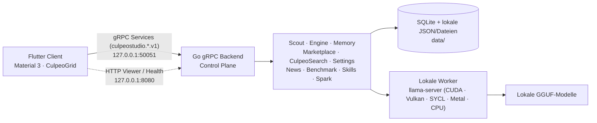

# So ist Culpeo Studio aufgebaut

> [!IMPORTANT]
> **Beta-Architekturreferenz.** Die primäre Steuerebene nutzt **gRPC-Services** (`culpeostudio.*.v1` auf Port 50051). Der Fiber HTTP-Server (Port 8080) dient `/health`-Probes und dem Standalone-Memory-Viewer.

## Überblick

Culpeo Studio besteht aus vier Teilen: einem Flutter-Desktop-Client, einem Go-gRPC-Backend, lokalen `llama-server`-Workern und Daten auf der eigenen Festplatte. Externe Anbieter werden nur von den Funktionen verwendet, die sie ausdrücklich brauchen.

## gRPC-Services

Das Backend stellt alle Modulfunktionen als gRPC-Services unter dem Paket `culpeostudio.*.v1` bereit:

| gRPC Paket | Service-Name | Aufgabe |
|---|---|---|
| `culpeostudio.login.v1` | `LoginService` | Authentifizierung, Benutzerkonten, Sitzungseinstellungen |
| `culpeostudio.scout.v1` | `ScoutService` | Scout-Sitzungen, Nachrichten, Tool-Ausführung, Bot-Verwaltung |
| `culpeostudio.engine.v1` | `EngineService` | Modellkatalog, Hardwareplanung, Instanzsteuerung, Fallbacks |
| `culpeostudio.memory.v1` | `MemoryService` | Beobachtungen, Prompts, Suche, Vektorindex, Kontextabruf |
| `culpeostudio.marketplace.v1` | `MarketplaceService` | Modellsuche, Downloads, Hardware-Eignung, API-Modelle |
| `culpeostudio.search.v1` | `SearchService` | CulpeoSearch Web-Suche und Text-Extraktion |
| `culpeostudio.news.v1` | `NewsService` | Artikel-Feeds, Kategorien, Suche, gespeicherte Artikel |
| `culpeostudio.benchmark.v1` | `BenchmarkService` | Leaderboard-Status, Rankings, Modellvergleiche |
| `culpeostudio.settings.v1` | `SettingsService` | Lokale Einstellungen und Provider-Verbindungstests |
| `culpeostudio.skills.v1` | `SkillsService` | Skills-Verwaltung und gRPC-Reflection |
