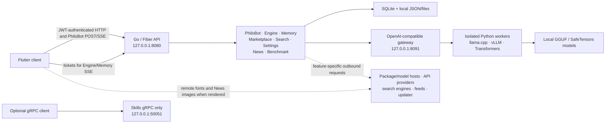

# PhiloEngine Architecture

**English** · [Deutsch](../de/docs/ARCHITECTURE.md)

> [!IMPORTANT]
> **Alpha architecture reference.** This describes the current local workspace,
> not a promise that every surface is production-ready. HTTP/SSE is primary:
> Engine and Memory event feeds use tickets, while PhiloBot streams through an
> authenticated POST. The only gRPC service currently wired into the server is
> **Skills**.

> [!WARNING]
> **Published-release boundary.** A development checkout can carry modules and
> routes that the package you installed does not have. Check the release notes
> of that build before relying on anything described here.

[← README](../README.md) · [Privacy](PRIVACY.md) · [Troubleshooting](TROUBLESHOOTING.md)

## At a glance

PhiloEngine is a local-first AI workbench with a Flutter client, a Go control plane, isolated Python model workers, and local persistence. Cloud providers and public web sources are optional or feature-specific; the system is not network-isolated by default.

The three fixed application listeners shown above bind to loopback by default.
Model workers use dynamically selected loopback ports. `HTTP_HOST` changes the
HTTP and gRPC bind host, while the model gateway rejects non-loopback binds.
Exposing either main service beyond the machine changes the security
assumptions described in [Privacy](PRIVACY.md).

## Component map

| Layer | Current role | Alpha boundary |
|---|---|---|
| Flutter client | Flutter source for desktop/web targets; public compiled artifacts currently cover Linux x64, Windows x64, and macOS ARM64 | A visible UI entry does not imply a local backend workflow |
| Go HTTP API | Primary control plane for accounts, PhiloBot, models, memory, search, settings, and content modules | API shapes can still change during alpha |
| SSE | PhiloBot chat streams over an authenticated POST; Engine and Memory event feeds use short-lived tickets | Event-feed tickets are intentionally single-use and expire quickly |
| gRPC | Skills service with reflection enabled | Other proto definitions are not registered services yet |
| Engine | Discovers models, plans resources, installs runtimes, starts workers, and handles fallback/rollback | Hardware and package compatibility is verified at runtime; no backend works on every machine |
| Memory | Per-user SQLite history, FTS5 search, vector index, summaries, and recall | Default embeddings are deterministic hash vectors, not a neural embedding model |
| PhiloSearch | Concurrent public-web metasearch and page extraction | Only the **text** category currently has registered engines |
| News | Feed aggregation, categorization, cache, and per-user saved articles | Experimental Phase 1 work; some sources are best-effort scrapers |
| Benchmark | LMArena text snapshot, filtering, comparison, and optional model metadata | Only `arena_text` is registered |

## HTTP control plane

The backend groups most application routes below `/api` and protects them with
JWT authentication. Memory routes can instead use their separate Memory bearer
token. Initial setup and login routes are exceptions. Health checks and selected
viewer/event paths are outside that group; Engine and Memory event feeds still
require purpose-built tickets.

| Route family | Responsibility |
|---|---|
| `/api/login`, `/api/auth`, `/api/accounts` | Setup, sign-in, account lifecycle, session preferences |
| `/api/philobot` | Sessions, messages, JWT-authenticated POST/SSE streaming, bots, projects, model binding, permission responses |
| `/api/engine` | Catalog, capabilities, runtime installation, instances, operations, metrics, gateway keys, SSE tickets |
| `/api/memory` | Health, observations, prompts, search, timeline, context, maintenance events |
| `/api/skills` | Skill discovery, import, rescan, update, deletion |
| `/api/marktplatz` | Model search, downloads, hardware profile, remote API-model configuration |
| `/api/search` | Text search, extraction, and engine discovery; other category routes are placeholders today |
| `/api/news` | Live/cache article lists and per-user saved articles |
| `/api/benchmark` | Board status, overview, leaderboard, details, comparison, refresh |
| `/api/settings` | Local settings, system data, provider connection tests |

The HTTP API is the supported integration surface for current clients. Do not infer a working gRPC method merely because a proto file exists.

## Model execution

1. The catalog scans the configured model directory for GGUF and SafeTensors artifacts.
2. The hardware probe collects current CPU, RAM, disk, and available accelerator information.
3. The planner reserves host/GPU headroom and proposes a context and placement plan.
4. A content-addressed Python environment is selected or installed and smoke-tested.
5. A loopback-only worker starts with a per-process bearer secret.
6. The local gateway forwards compatible generation requests to the active worker.
7. Runtime, device, KV-cache, and reduced-context fallbacks can be attempted; the last known-good state can be restored after a failed change.

| Model / host | Preferred runtime | Notes |
|---|---|---|
| GGUF | llama.cpp | CPU and supported accelerator builds; package installation may compile native code |
| SafeTensors on Linux with suitable CUDA or ROCm | vLLM | Can fall back to Transformers when startup or compatibility checks fail |
| Other supported SafeTensors hosts | Transformers | Used for CPU and supported accelerator fallbacks |

Runtime environments are downloaded on demand and require a host Python 3 installation. llama.cpp builds also require CMake and C/C++ build tools; accelerator builds can require the matching SDK and drivers. After installation, workers request local model files only and set common Hugging Face/Transformers offline flags. First-time runtime installation is therefore different from offline inference.

`trust_remote_code` is disabled by default and can be enabled explicitly per model. PhiloEngine currently changes KV-cache modes; it does **not** claim to quantize model weights automatically.

## Memory and recall

Memory uses one SQLite database with structured sessions, prompts, observations, summaries, FTS5 documents, and sqlite-vec indexes. Recall is scoped by user and can be filtered by project, source, layer, and category.

- The default embedding backend is a deterministic 128-dimensional hash implementation.
- Optional local ONNX, Ollama, and remote API embedding backends can be configured.
- An unavailable optional backend falls back to the hash implementation.
- Search combines lexical, vector, recency, type, and source signals.
- Compression keeps recent observations active and produces deterministic rule-based summaries by default.

This is useful hybrid retrieval, but it should not be described as neural semantic memory unless a neural embedding backend is actually configured.

The repository contains a manual ONNX embedding service under
`backend/sidecar/`, which defaults to `127.0.0.1:8092`. It is not started by
`start.sh` and is not part of the Quickinstall payload. ONNX
memory embeddings therefore require a separate source installation and process;
selecting `onnx_local` without that service falls back to the hash backend.

## Search, News, and Benchmark

PhiloSearch currently registers Wikipedia, Bing, Brave, Google, and DuckDuckGo as **text** engines. The HTTP and CLI shapes also expose news, image, video, and book categories, but those categories have no engines registered yet. HTML-scraping providers are best effort and can fail when upstream markup or rate limits change.

The local News implementation refreshes on startup and every 15 minutes. It
combines RSS/Atom feeds with selected HTML sources, keeps the last usable cache
on failure, and, in the newer development state, stores saved article snapshots
per user. At backend startup, the local Benchmark implementation loads its
single LMArena text snapshot and launches a refresh when the snapshot is missing
or older than 24 hours. A manual refresh is also available; there is no separate
daily timer. The previous snapshot remains usable if the source is unavailable.

> [!WARNING]
> News and Benchmark are **alpha modules**. Their routes and screens can change
> between releases. Check the installed build and its release notes before
> relying on the behaviour described here.

## Persistence and trust boundaries

Most mutable backend state defaults to a `data/` directory below the backend
working directory. A source launch therefore uses `backend/data/`; Quickinstall
uses the persistent `<install-root>/backend/data/` directory outside its
versioned application bundles. This includes the memory database,
account/authentication material, runtime environments, snapshots, and JSON
stores. Model and project directories can be configured elsewhere.

- Passwords are bcrypt hashes.
- JWT, memory, TOTP, and worker secrets are separate values.
- Secret and credential stores use owner-only permissions where the platform supports them. Not every runtime, project, or chat file uses the same mode, so the complete data directory must be protected at the operating-system level.
- Model workers bind to loopback and require a random per-process bearer token.
- Remote-code execution for model repositories is opt-in.

These are application safeguards, not an operating-system sandbox. PhiloBot resolves and checks file-tool paths against allowed roots, but an allowed executable still runs with the filesystem permissions of the PhiloEngine process. See [Privacy and security boundaries](PRIVACY.md#security-boundaries) before working with untrusted models, projects, or commands.

## Maturity summary

PhiloEngine is an alpha system with real end-to-end paths and deliberately visible limits:

- HTTP/SSE is primary; gRPC is Skills-only. Only Engine and Memory event feeds use SSE tickets; PhiloBot streams through an authenticated POST.
- Search is text-only today despite broader route placeholders.
- Runtime support depends on the host, drivers, compilers, and installable packages.
- Resource planning reduces risk but cannot guarantee that the OS never swaps or that a model will fit.
- Training and model-weight quantization should not be documented as finished engine capabilities.
- News and Benchmark are experimental; their workflows can change between releases.
- The optional ONNX embedding sidecar is a separately started source component, not a current Quickinstall service.
- Update archives are checked against size and SHA-256 values from the manifest, but the current updater does not verify a publisher signature.
- Game-development workflows and shared model/compute capacity are roadmap directions, not current capabilities.

Continue with [Privacy](PRIVACY.md) for data-flow details or [Troubleshooting](TROUBLESHOOTING.md) for concrete checks.
