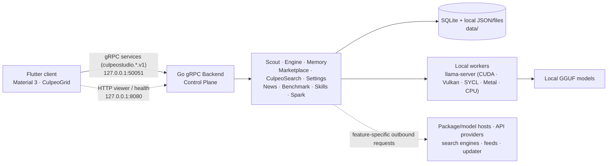

# How Culpeo Studio is put together

> [!IMPORTANT]
> **Beta architecture reference.** This document describes the current local workspace.
> The primary control plane uses **gRPC services** (`culpeostudio.*.v1` on port 50051).
> The Fiber HTTP server (port 8080) is dedicated to `/health` probes and the standalone memory viewer.

## At a glance

Culpeo Studio has four main pieces: a Flutter desktop client, a Go gRPC backend, local `llama-server` workers, and storage on disk. Cloud providers and public web sources are only used by the features that need them.

## Components

| Layer | Current role | Beta boundary |
|---|---|---|
| Flutter client | Flutter desktop client (`culpeostudio`) with Material 3 & CulpeoGrid layouts; compiled artifacts for Linux x64, Windows x64, macOS ARM64 | UI components interact reactively via gRPC |
| Go gRPC API | Primary control plane for auth, Scouts, models, memory, search, settings, news, benchmark, and skills | All modules register `culpeostudio.<module>.v1` gRPC services |
| HTTP Server | Fiber HTTP server running on 127.0.0.1:8080 for health checks (`/health`) and memory viewer rendering | Restricted to viewer and probe paths |
| Engine | Discovers models, plans hardware resources, manages local `llama.cpp` (`llama-server`) instances, handles auto-fallback | Hardware probe collects GPU/RAM telemetry before model start |
| Memory | SQLite storage with FTS5 search, sqlite-vec vector index, summaries, and context budget management | Default embedding is a deterministic 128-d hash implementation; optional ONNX sidecar available |
| Scout & Spark | Assistant manager and agent runner. Scouts support custom prompts, trigger words, model binding, planning mode, project tools, permission prompts, and diffs | Tool execution is bounded by allowed project roots |
| CulpeoSearch | Concurrent public-web metasearch and HTML page extraction | Registered text engines: DuckDuckGo, Brave, Google, Bing, Wikipedia |
| News | Feed aggregation (RSS/Atom), categorization, cache, and per-user saved articles | Refreshes on startup and 15-minute intervals |
| Benchmark | Integrated LMArena text leaderboard, filtering, comparison, and model details | Refreshes snapshot automatically or on demand |

## gRPC services

The backend exposes module interfaces as gRPC services registered under package `culpeostudio.*.v1`:

| gRPC Package | Service Name | Responsibility |
|---|---|---|
| `culpeostudio.login.v1` | `LoginService` | Setup, sign-in, account lifecycle, session preferences |
| `culpeostudio.scout.v1` | `ScoutService` | Scout sessions, messages, tool execution, bot management, project bindings |
| `culpeostudio.engine.v1` | `EngineService` | Catalog, hardware planning, instance management, metrics, fallbacks |
| `culpeostudio.memory.v1` | `MemoryService` | Observations, prompts, search, vector index, timeline, context retrieval |
| `culpeostudio.marketplace.v1` | `MarketplaceService` | Model discovery, downloads, hardware compatibility, API model config |
| `culpeostudio.search.v1` | `SearchService` | CulpeoSearch web search and page extraction (rate-limited) |
| `culpeostudio.news.v1` | `NewsService` | Article feeds, categories, search, saved items |
| `culpeostudio.benchmark.v1` | `BenchmarkService` | Leaderboard status, ranking, model comparison, snapshot refresh |
| `culpeostudio.settings.v1` | `SettingsService` | Local application settings and provider connectivity tests |
| `culpeostudio.skills.v1` | `SkillsService` | Skill discovery, import, update, deletion |

## What happens when a local model starts

1. The catalog scans the model directory for GGUF artifacts.
2. The hardware probe collects current CPU, RAM, disk, and GPU/VRAM telemetry.
3. The planner calculates resource requirements and proposes context size and placement.
4. The local `llama-server` process starts on a loopback port with a bearer token.
5. The engine proxies inference requests to the active worker.
6. Reduced-context or CPU fallbacks are attempted if initial GPU placement fails.

## Local data and trust boundaries

Backend state is kept under `backend/data/` (or `<install-root>/backend/data/` for Quick Install):
- SQLite database (`culpeo.db` / `memory.db`) for memory, chats, and accounts.
- Bcrypt password hashing and JWT authentication tokens.
- Scout path checks ensure tool access is confined to configured project directories.
