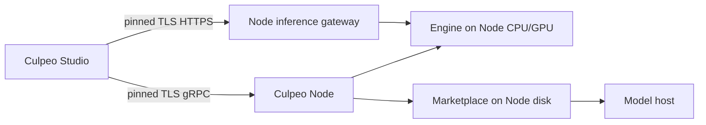

# Culpeo Node

A **Culpeo Node** is a small backend that runs on the machine which owns the
disk, CPU and GPU for remote models. It contains only:

- the Engine (model catalog, runtimes, start/stop and inference),
- the Marketplace (search, download jobs and disk checks), and
- a small Node control service.

It is not a headless copy of Culpeo Studio. It does not start Login, Memory,
Scout, Skills, News, providers or a Studio-side node registry.

The normal flow is deliberately short:

1. Install and start Culpeo Node on the remote machine.
2. Run `culpeo-node pairing-link` there.
3. In **Studio → Nodes → Add node**, paste that one link.
4. Select the node in Marketplace or Engine.

When Studio asks for a download, the request goes to the Node and the Node
downloads the model directly to its own model directory. When Studio starts a
model, the Node starts it on its own CPU/GPU. Model weights and runtimes never
pass through Studio.

## Network requirement

Studio must be able to reach the Node. There is no hidden VPN, tunnel setup or
network-interface manipulation.

For a directly reachable Node, allow these TCP ports from the Studio machine:

| Port | Purpose |
| --- | --- |
| `50051` | TLS gRPC control plane: status, Marketplace, Engine |
| `50052` | TLS OpenAI-compatible inference gateway |

If the Node is behind NAT, use port forwarding, an existing VPN/reverse proxy,
or a later relay service. A Node behind NAT cannot be reached by a desktop
application without one of those routes.

## Build and run from this checkout

For development, build only the Node binary:

```bash
cd backend
go build -o culpeo-node ./cmd/node

export CULPEO_NODE_DATA_DIR=/var/lib/culpeo-node
export CULPEO_NODE_ADVERTISE=node.example.org:50051
export CULPEO_NODE_NAME='Workshop'

./culpeo-node
```

`CULPEO_NODE_ADVERTISE` is the reachable gRPC address that Studio will use.
It is required when the listener binds to all interfaces (the default). The
Node prints no secret to service logs. To reveal the one pairing link on
purpose, run:

```bash
./culpeo-node pairing-link
```

Paste the complete `culpeo-node://pair/...` line into Studio. The link is a
credential: anyone holding it can control this Node, so treat it like a
password.

## Configuration

The normal installation needs only `CULPEO_NODE_ADVERTISE`; the rest has safe
defaults.

| Variable | Default | Meaning |
| --- | --- | --- |
| `CULPEO_NODE_DATA_DIR` | `data/culpeo-node` | Private Node state, TLS certificate, jobs and Engine state |
| `CULPEO_NODE_MODEL_DIR` | `<data-dir>/models` | Where this Node downloads model weights |
| `CULPEO_NODE_LISTEN` | `0.0.0.0:50051` | gRPC listener |
| `CULPEO_NODE_ADVERTISE` | required for wildcard listener | Reachable gRPC `host:port` included in the pairing link |
| `CULPEO_NODE_GATEWAY_LISTEN` | `0.0.0.0:50052` | TLS inference gateway listener |
| `CULPEO_NODE_GATEWAY_ADVERTISE` | same host as `CULPEO_NODE_ADVERTISE`, port `50052` | Public gateway `host:port`; use this for a different NAT/proxy port |
| `CULPEO_NODE_NAME` | `Culpeo Node` | Name shown in Studio |
| `CULPEO_NODE_VERSION` | `dev` | Version reported to Studio |

The Node creates a persistent identity and self-signed TLS certificate in its
data directory. Do not delete those files while Studio is paired: their
fingerprint and token are what make the connection trusted.

## Security model

The pairing link includes a Node endpoint, a TLS certificate fingerprint and a
pairing token.

- Studio pins the TLS leaf certificate before sending the pairing token.
- The token can call only NodeAgent, Engine and Marketplace methods. It cannot
  log in to Studio or access Memory, Scout, Settings or a node registry.
- Engine key/preset import/export methods remain blocked for pairing tokens.
- The public inference gateway uses the same pinned TLS certificate and an
  Engine gateway key issued only over the authenticated control connection.
- The local Engine gateway stays on an ephemeral loopback address. The public
  TLS gateway proxies only `/v1/` requests; it cannot become a generic proxy.

If a pairing link leaks, remove the Node from Studio and rotate its identity
with a deliberate Node data-directory reset, then add the newly generated link
again. Do not put pairing links into tickets, shell history shared with other
users, or public logs.

## What Studio routes where



| Studio action | Where it runs |
| --- | --- |
| Browse target hardware / free disk | Node Marketplace and Node agent |
| Download model to a selected Node | Node Marketplace downloads directly to the Node model directory |
| Start, stop or inspect model | Node Engine on the Node hardware |
| Chat with a ready Node model | Node Engine through the pinned HTTPS gateway |

## Troubleshooting

| Studio shows | Check |
| --- | --- |
| **Not reachable** | Is the Node service running? Is `CULPEO_NODE_ADVERTISE` reachable from the Studio machine on TCP 50051? |
| **Token rejected** | Paste a fresh link from the same Node data directory. A reset identity requires removing and re-adding the Node. |
| Node is online but chat cannot answer | Allow the configured gateway port (default TCP 50052) and ensure it maps to `CULPEO_NODE_GATEWAY_ADVERTISE`. |
| Download says disk space is insufficient | The check is performed on the Node's model directory, not Studio's disk. Change `CULPEO_NODE_MODEL_DIR` on the Node if required. |
| Model begins downloading locally | This is expected: Studio only schedules it; the Node transfers the model directly from the model host. |

Useful service commands are:

```bash
systemctl status culpeo-node
journalctl -u culpeo-node -f
culpeo-node pairing-link
```
